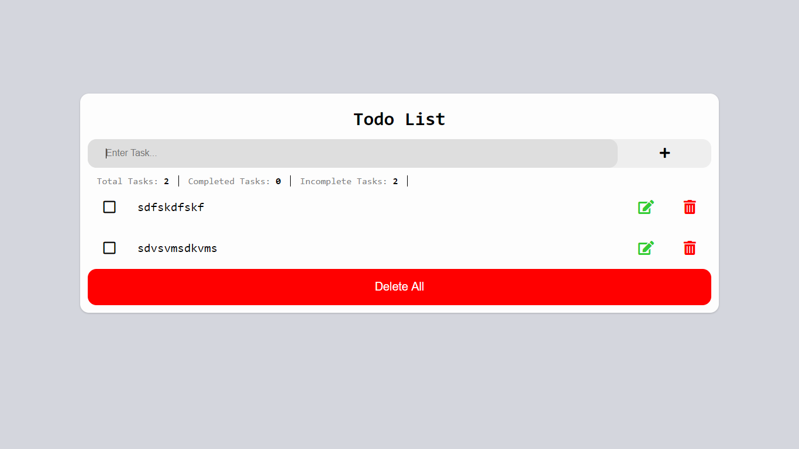

# Vanilla Js TodoList

> This is a todo List project made using Vanilla Javascript.
> You can view the project at: https://lakshdhamija.github.io/VanillaJSTodoList/

---

### Table of Contents

- [Description](#description)
- [Installation](#how-to-use)
- [Author Info](#author-info)

---

## Description

In this Todo List, one can perform tasks like :-
1. Add a Task
2. Delete a Task
3. Edit a Task
4. Delete All tasks
5. Mark Tasks as done 
6. View Total Tasks/ Completed Tasks/ Incomplete Tasks

#### Technologies

- Javascript
- HTML
- CSS

---

## Installation
To run the project, simply clone or download the repository to your local system and open indexx.html in browser.

---

## Author Info

- LinkedIn - [@lakshdhamija](https://linkedin.com/in/laksh-dhamija)

